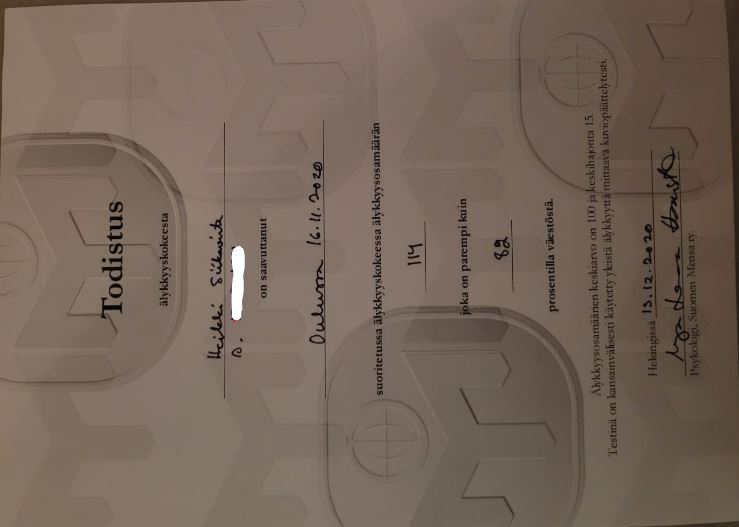
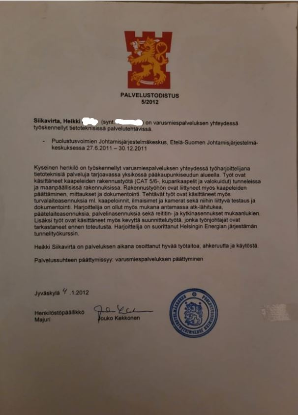

<!-- The structure is following, where the text is below the image! Example
below:

			
  
<b>Pranic Healing Basic Course,</b> Certificate, 2026.

  todo frames.jpg is for, if one wants to add frames to cert! -->

    
  <text>Contains all the rest/off topic certifcations.   Makes CV/Portfolios
  dynamic and small.

   

		
		

			
		

	
Certifications
 
<b>Reference report, Avila,</b>
  	Reference report, 2024.

		
		

			
		

   
<b>Web Developer Academy, Saranen Consulting,</b> Certificate, 2018.

		
	
<b>CCNA Routing and Switching: Introduction to Networks,</b> Certificate, 2016.

		
	
<b>Cisco Networking Academy® Introduction to Cybersecurity course,</b> Certificate, 2016.

		
	
<b>Wado-ryu,</b> Certificate, 2012.

		
	
<b>Military sport,</b> Certificate, 2011.

		
	
<b>Homepage,</b> Certificate unofficial, when was in High School, 2006.

		
	
<b>Mensa IQ test official,</b> Certificate, when was freaking tired. If one sees these meaningful and or speeds up recruitment process, 2020.

		
 	
<b>My first block test from company, Kide systems.</b> Certificate,
 	unofficial when got first IT job, 2018.

		<!-- FROM HERE TO BELOW IS SPORT AND NON-TECH RELATED -->
		
 	
<b>Helsingin Energia, Tunnel Course,</b> Certificate, 2011.

		
	
<b>Spring House for effective job seeking,</b> Certificate, when was at mercy of MOL, 2012.

		
	
<b>Pranic Healing Basic Course,</b> Certificate, 2026.

#### Additional stuff.

- [ ] Make naming coherent as possible! for all tags!